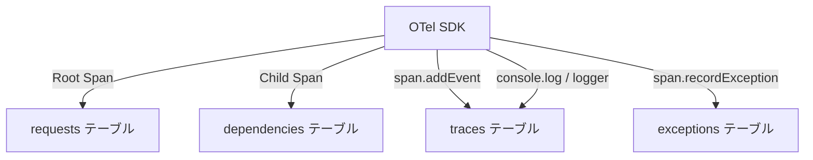
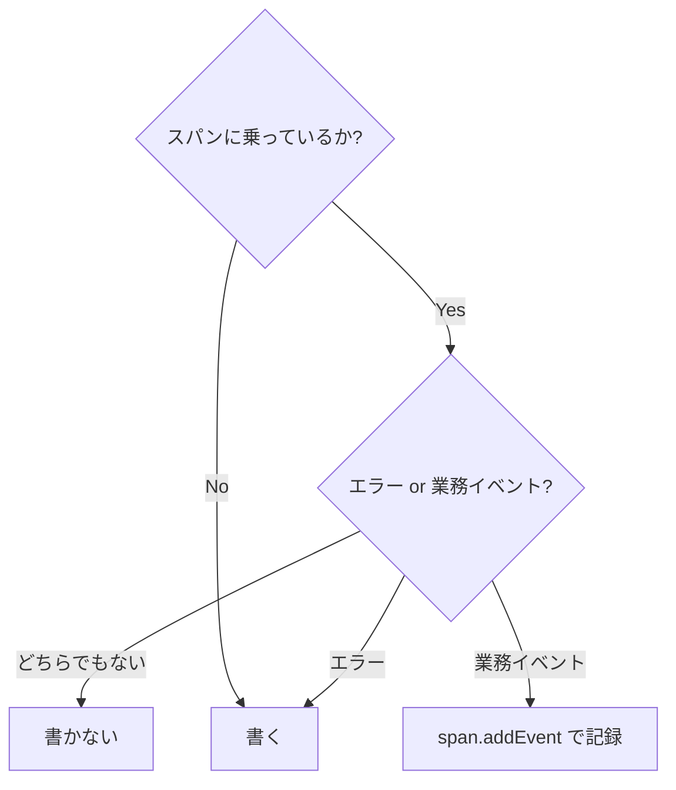

## はじめに — 結論を先に書く

**OTelスパンに乗っているログは、原則として書かない。**

ログ設計の記事を探すと、「何を書くか」「どのレベルで書くか」の話がほとんどです。
フューチャー社のガイドラインや各社のベストプラクティスは良質ですが、
OpenTelemetry(以下 OTel)が普及した後の世界では、論点が変わります。

この記事では、外部サービス連携を含む Web アプリケーションでのログ規約再設計を題材に、
「書かないログ」の判断基準と、文言衝突を起こさない規約の作り方を具体的に紹介します。

:::message
**この記事のスタック**:
Next.js (App Router) + TypeScript +
`@azure/monitor-opentelemetry` + Azure Application Insights
:::

---

## 1. spanとログの役割分担

### TL;DR

スパンは「線分」、ログは「点」です。OTel を入れると、線分情報のほとんどはスパンが持ちます。ログに書くべきは、スパンが表現できない「例外的な点」だけです。

### 1.1 spanとは何か

ログが「その瞬間に何が起きたか」を記録する点であるのに対し、スパンは **開始〜終了までの線分** です。1 つのスパンが持つ情報を整理すると以下のようになります。

```text
span {
  name:        "POST /orders"
  startTime:   2026-01-15T09:00:00.000Z
  endTime:     2026-01-15T09:00:00.142Z
  duration:    142ms
  status:      OK / ERROR
  attributes:  { "http.method": "POST", "http.status_code": 200, ... }
  events:      [ { name: "order.created", timestamp: ..., attributes: {...} } ]
}
```

開始時刻、終了時刻、所要時間、成否、付加情報がすべて 1 レコードに入っています。**「リクエスト受信ログ」も「処理完了ログ」も、このスパン 1 件で完全に代替できます。**

### 1.2 App Insights でのテーブル対応

OTel のデータが Azure Application Insights に送られると、以下のテーブルにマッピングされます。

<!-- markdownlint-disable MD013 -->
| OTel 概念 | App Insights テーブル | 主な内容 |
| --- | --- | --- |
| Root span (HTTPリクエスト) | `requests` | エンドポイント、ステータスコード、duration |
| 子 span (DB・外部API) | `dependencies` | 依存先名、種別、duration |
| span event | `traces` または span 詳細 | `span.addEvent()` で追加したイベント |
| logger 出力 (`console.log` 等) | `traces` | 自由記述のログ |
| 例外 | `exceptions` | スタックトレース、エラーメッセージ |
<!-- markdownlint-enable MD013 -->



重要なのは、**`requests` と `dependencies` は OTel を入れるだけで自動的に埋まる** という点です。自前でログを書かなくても、リクエストの開始・終了・所要時間・成否はすべて記録されています。

### 1.3 KQL で span を見る基本クエリ

App Insights の Log Analytics ワークスペースで、以下のクエリを実行するだけで全体像が把握できます。

```kql
// 全エンドポイントの一覧
requests
| distinct name, resultCode
| order by name asc
```

```kql
// 子 span (DB・外部API) の一覧
dependencies
| distinct name, type
| order by type asc, name asc
```

```kql
// 単一トレースを横断して見る
union requests, dependencies, traces, exceptions
| where operation_Id == "your-trace-id-here"
| order by timestamp asc
| project timestamp, itemType, name, resultCode, duration, message
```

この「単一トレース横断クエリ」が強力です。1 つのリクエストで何が起きたかを時系列で追えます。**ここに追いたい情報がスパンに乗っていれば、ログを別途書く必要はありません。**

---

## 2. 書かなくていいログを見極める

### TL;DR

「スパンに乗っているか？」が判断の起点。乗っているなら書かない。書くのは失敗ログと業務イベントだけです。



### 2.1 開始ログは書かない

「リクエストを受信しました」「処理を開始します」の類は削除できます。

スパンの `startTime` がそれを表しています。App Insights の `requests` テーブルには、リクエストが来た時刻が自動で入ります。

```typescript
// Before: 書かなくていい
export async function POST(req: Request) {
  logger.info("注文作成リクエスト受信"); // ← 不要
  // ...
}

// After: スパンに任せる
export async function POST(req: Request) {
  // requests テーブルに自動記録される
  // ...
}
```

**例外**: 以下のケースは開始ログを書く価値があります。

- バッチジョブなど、HTTP スパンが存在しない処理
- 数分以上かかる可能性がある非同期ジョブ(途中経過を残したい)
- OTel 計装が効いていない外部ライブラリの呼び出し

### 2.2 ルーチンな成功ログも書かない

「注文作成が完了しました」「ユーザー認証に成功しました」も、スパンの `status: OK` と `resultCode: 200` で表現されています。

問題は、**この「成功ログ」こそが後述する「文言被り問題」の温床** になることです。API 層でも書く、DB 層でも書く、外部 API 呼び出し層でも書く……その結果、同じ業務操作について複数の「〜成功」ログが溢れます。

成功の事実はスパンに任せ、ログには書かない。これが基本方針です。

業務上「この操作が行われた」という事実を残したい場合は、`span.addEvent()` を使います。

```typescript
import { trace } from "@opentelemetry/api";

const span = trace.getActiveSpan();

// ログに書く代わりに span event として記録
span?.addEvent("order.created", {
  "order.id": order.id,
  "order.amount": order.amount,
});
```

`span.addEvent()` で追加したイベントは App Insights の `traces` テーブルに記録され、かつそのスパン(= リクエスト)と紐づきます。単独のログより文脈が豊かです。

### 2.3 DB 操作ログも書かない

Prisma を使っている場合、OTel の自動計装により DB 操作が `dependencies` テーブルに自動で入ります。

```kql
// Prisma の span を確認するクエリ
dependencies
| where type == "InProc"
| where name startswith "prisma"
| project timestamp, name, duration, data
| order by timestamp desc
| take 50
```

実際に取れるスパン名の例:

<!-- markdownlint-disable MD013 -->
| スパン名 | 意味 |
| --- | --- |
| `prisma:client:operation` | Prisma クライアントレベルの操作 |
| `prisma:engine:query` | 実際に発行された SQL |
<!-- markdownlint-enable MD013 -->

`data` フィールドには実行されたクエリも含まれています。**「DB への書き込みを開始します」「DB への書き込みが完了しました」は、このスパンで完全に代替できます。**

```typescript
// Before: 書かなくていい
async function createOrder(input: CreateOrderInput) {
  logger.info("DB への注文挿入を開始"); // ← 不要
  const order = await prisma.order.create({ data: input });
  logger.info("DB への注文挿入が完了", { orderId: order.id }); // ← 不要
  return order;
}

// After: Prisma の自動計装に任せる
async function createOrder(input: CreateOrderInput) {
  return prisma.order.create({ data: input });
}
```

### 2.4 書くべきは何か

削除したあとに残るべきログは、大きく 2 種類です。

**① 失敗ログ (ERROR / WARN)**

スパンのステータスだけでは「なぜ失敗したか」が分かりません。人間が読む文章と、デバッグに必要な文脈をここで書きます。

**② 業務イベント**

SLA 集計、監査証跡、ビジネス指標など、開発者以外も参照する可能性があるイベントです。
`span.addEvent()` か、意味のある ERROR/WARN ログで記録します。

---

## 3. 文言被り問題の解決

### TL;DR

**文言が衝突したら、片方を消す。** レイヤー名を付けて書き分けるより、書かない方が長期的に楽です。

### 3.1 文言被りはなぜ起きるか

チームでログ規約を作ると、必ずこの問題にぶつかります。

```text
INFO  注文作成成功  ← API ハンドラが書く
INFO  注文作成成功  ← DB 操作関数が書く
```

同じ「注文作成」という業務操作を、API 層と DB 層の両方で記録しているから被ります。
Log Analytics でこのメッセージを検索すると、1 リクエストで 2 件ヒットします。

### 3.2 解決アプローチ 3 つ

<!-- markdownlint-disable MD013 -->
| 案 | 内容 | 評価 |
| --- | --- | --- |
| **レイヤー明示** | `注文作成API成功` / `注文作成DB成功` | 機械的で読みづらい。スパンの type と役割が重複する |
| **動詞変更** | `注文作成成功` / `注文登録成功` | 自然だが Prisma の `create` と意味的に齟齬が出る |
| **片方を消す** | API 層だけ書く、DB 層はスパンに任せる | **推奨** |
<!-- markdownlint-enable MD013 -->

推奨は「片方を消す」です。DB 操作は Prisma スパンで見えているので、DB 層の成功ログは削除できます。API 層の成功ログも、ルーチンな成功なら不要です。

**結果的に「注文作成成功」を書くべきシーンがほぼなくなります。**

### 3.3 `/start` の例: 業務動詞と開始ログが衝突するケース

エンドポイント名が `POST /exports/:id/start`(エクスポート開始)のような場合、
「処理開始ログ」を書こうとすると奇妙なことが起きます。

```text
INFO  エクスポート開始処理を開始します  ← 「開始の開始」
```

業務上の「開始」と、処理のライフサイクル上の「開始」が衝突しています。
これを解決しようとして `エクスポート開始APIリクエスト受信` と書いても、
`requests` テーブルにはすでに `POST /exports/:id/start` の記録があります。

**この衝突は、開始ログを書かないことで自然に解消されます。**

エクスポートが開始された事実を残したいなら:

```typescript
span?.addEvent("export.started", {
  "export.id": exportId,
  "export.startedAt": new Date().toISOString(),
});
```

### 3.4 「文言が衝突したら書かないサイン」

逆説的ですが、**ログの文言を考えるのが難しい = そのログはスパンで代替できる** という経験則があります。

- 「API成功」か「DB成功」か迷う → どちらも書かない
- 「開始」と「受信」どちらが正しいか迷う → 開始ログを書かない
- 「完了」か「成功」か迷う → ルーチンな成功ログを書かない

迷いが生じた時点で「スパンに任せられないか」を検討する、というのがチーム規約にしやすいルールです。

---

## 4. 残すログの文言ルール

### TL;DR

残すログ(主に ERROR/WARN)は、フォーマットを統一することでアラートの信頼性と KQL の書きやすさが上がります。

### 4.1 基本フォーマット: 「対象 + 動作 + 状態」

```text
対象      動作     状態
注文      作成     失敗
認証      確認     タイムアウト
決済 API  呼び出し エラー
```

体言止め(〜失敗、〜エラー)で統一します。文末に句点はつけません。

### 4.2 メッセージに変数を埋めない

```typescript
// Bad: メッセージに変数が混入している
logger.error(`注文 ${orderId} の作成に失敗しました`);

// Good: メッセージは固定、変数は構造化フィールドへ
logger.error("注文作成失敗", { orderId, reason: error.message });
```

メッセージが可変だと、KQL の `where message == "..."` が使えなくなります。アラートルールも書きにくくなります。**メッセージは固定文字列、変数は別フィールド**が鉄則です。

### 4.3 WARN と ERROR の使い分け

<!-- markdownlint-disable MD013 -->
| レベル | 使いどき | 例 |
| --- | --- | --- |
| **WARN** | クライアント起因のエラー (4xx) | バリデーション失敗、認証失敗、権限なし、競合 |
| **ERROR** | サーバー起因のエラー (5xx) | DB 障害、外部 API 失敗、予期しない例外 |
<!-- markdownlint-enable MD013 -->

4xx は「クライアントの誤り」であり、サーバー側は正常に動いています。WARN で記録して運用チームを不必要に叩き起こさないようにします。

```typescript
// 4xx: WARN
if (error instanceof ValidationError) {
  logger.warn("注文作成リクエスト不正", {
    validationErrors: error.errors,
  });
  return Response.json({ error: "Bad Request" }, { status: 400 });
}

// 5xx: ERROR
logger.error("注文作成失敗", {
  orderId,
  error: error.message,
  stack: error.stack,
});
return Response.json({ error: "Internal Server Error" }, { status: 500 });
```

### 4.4 Good / Bad 対比

```typescript
// ❌ Bad: 体言止めでない、変数混入、レベルが不正確
logger.info(`注文 ${orderId} を作成しました。`);
logger.error(`ユーザー ${userId} の認証に失敗しました`); // 4xx なのに ERROR

// ✅ Good: 体言止め、変数分離、レベル正確
logger.warn("認証失敗", { userId, reason: "invalid_token" });
```

```typescript
// ❌ Bad: 開始ログ + 成功ログを両方書いている
logger.info("決済API呼び出し開始", { orderId });
const result = await paymentClient.charge(params);
logger.info("決済API呼び出し完了", { orderId });

// ✅ Good: 失敗時だけ書く。成功はスパンに任せる
try {
  const result = await paymentClient.charge(params);
  return result;
} catch (error) {
  logger.error("決済API呼び出し失敗", {
    orderId,
    error: (error as Error).message,
  });
  throw error;
}
```

```typescript
// ❌ Bad: 重複メッセージ (API層 + DB層で同じ文言)
// api-handler.ts
logger.info("注文作成成功", { orderId });
// order-repository.ts
logger.info("注文作成成功", { orderId }); // 被る

// ✅ Good: DB層の成功ログは削除。スパンが持っている
// api-handler.ts: 業務イベントとして span event に記録
span?.addEvent("order.created", { "order.id": orderId });
// order-repository.ts: 成功ログなし
```

---

## 5. 実例: 外部API連携を含むエンドポイントのログ規約

### TL;DR

規約はエンドポイントごとに「出力する」「出力しない」を明示するのが最も伝わります。

### 5.1 規約のフォーマット

以下は実際に使用している規約ドキュメントのフォーマットです。

```markdown
## POST /orders (注文作成)

### 出力する

| レベル | メッセージ              | タイミング               |
| ------ | ----------------------- | ------------------------ |
| WARN   | 注文作成リクエスト不正  | バリデーション失敗 (400) |
| WARN   | 認証失敗                | 未認証 (401)             |
| WARN   | 注文作成権限なし        | 権限不足 (403)           |
| WARN   | 注文作成競合            | 重複リソース (409)       |
| ERROR  | 注文作成失敗            | 予期しない例外 (500)     |
| ERROR  | 決済API呼び出し失敗     | 外部API障害時            |

### 出力しない (spans / requests で代替)

- リクエスト受信・処理開始・処理完了
- DB 挿入の開始・完了 (Prisma スパンで代替)
- バリデーション通過、認証成功などの正常通過
- 決済 API 呼び出し開始・完了 (依存スパンで代替)
```

「出力しない」欄に理由を書くのがポイントです。理由がないと、後から見た人が「書き忘れか？」と疑って追加してしまいます。

### 5.2 ハンドラ実装例 (TypeScript)

```typescript
import { trace, SpanStatusCode } from "@opentelemetry/api";
import { logger } from "@/lib/logger";
import { prisma } from "@/lib/prisma";
import { paymentClient } from "@/lib/payment";

export async function POST(req: Request) {
  const span = trace.getActiveSpan();

  let body: unknown;
  try {
    body = await req.json();
  } catch {
    logger.warn("注文作成リクエスト不正", { reason: "invalid_json" });
    return Response.json({ error: "Bad Request" }, { status: 400 });
  }

  const parsed = createOrderSchema.safeParse(body);
  if (!parsed.success) {
    logger.warn("注文作成リクエスト不正", {
      errors: parsed.error.flatten(),
    });
    return Response.json({ error: "Bad Request" }, { status: 400 });
  }

  const { productId, quantity } = parsed.data;

  try {
    // 外部決済APIを呼び出す (失敗時のみログ)
    let payment: PaymentResult;
    try {
      payment = await paymentClient.charge({ productId, quantity });
    } catch (error) {
      logger.error("決済API呼び出し失敗", {
        productId,
        error: (error as Error).message,
      });
      throw error;
    }

    // DB に保存 (Prisma スパンが自動記録するのでログ不要)
    const order = await prisma.order.create({
      data: {
        productId,
        quantity,
        paymentId: payment.id,
      },
    });

    // 業務イベントを span event として記録
    span?.addEvent("order.created", {
      "order.id": order.id,
      "order.amount": order.amount,
    });

    return Response.json(order, { status: 201 });
  } catch (error) {
    span?.setStatus({
      code: SpanStatusCode.ERROR,
      message: (error as Error).message,
    });
    span?.recordException(error as Error);

    // 決済APIエラーは上位で既にログ出力済み
    if (!(error instanceof PaymentError)) {
      logger.error("注文作成失敗", {
        productId,
        error: (error as Error).message,
      });
    }

    return Response.json({ error: "Internal Server Error" }, { status: 500 });
  }
}
```

### 5.3 実際に使う KQL クエリ集

**直近 1 時間の `POST /orders` 失敗一覧**

```kql
requests
| where timestamp > ago(1h)
| where name == "POST /orders"
| where success == false
| project timestamp, resultCode, duration, operation_Id
| order by timestamp desc
```

**特定トレースの全部入り (インシデント調査用)**

```kql
let traceId = "your-operation-id";
union requests, dependencies, traces, exceptions
| where operation_Id == traceId
| order by timestamp asc
| project
    timestamp,
    itemType,
    name,
    resultCode,
    duration,
    message,
    customDimensions
```

**外部決済API 呼び出しの p95 レイテンシ (週次レポート用)**

```kql
dependencies
| where timestamp > ago(7d)
| where name contains "payment"
| summarize
    p50 = percentile(duration, 50),
    p95 = percentile(duration, 95),
    p99 = percentile(duration, 99),
    count = count()
    by bin(timestamp, 1d)
| order by timestamp asc
```

**カスタム属性で絞るクエリ (span.addEvent の活用)**

```kql
traces
| where timestamp > ago(24h)
| where message == "order.created"
| extend orderId = tostring(customDimensions["order.id"])
| extend amount = todouble(customDimensions["order.amount"])
| summarize
    ordersCreated = count(),
    avgAmount = avg(amount)
    by bin(timestamp, 1h)
| order by timestamp asc
```

---

## 6. 規約をチームに浸透させる工夫

### TL;DR

ドキュメントだけでは浸透しません。instructions のスコープ分割・Skills による手動レビュー・
PR チェックリストの三点セットで機械的に強制します。

### 6.1 GitHub Copilot custom instructions に書く

#### 基本: `copilot-instructions.md` に全体ルールを置く

`.github/copilot-instructions.md` に書いた内容は、リポジトリ全体のすべての
Copilot インタラクションに自動適用されます。

```markdown
## ログ規約 (OpenTelemetry + Azure Application Insights)

### 書かないログ

- リクエスト受信・処理開始・処理完了ログは書かない (OTel スパンで代替)
- DB 操作の開始・完了ログは書かない (Prisma 自動計装で代替)
- 外部 API 呼び出しの開始・完了は書かない (dependencies スパンで代替)
- 4xx / 5xx を問わず「成功」ログは書かない

### 書くログ

- 4xx エラー: `logger.warn("〈対象〉〈動作〉〈状態〉", { ...fields })`
- 5xx エラー: `logger.error("〈対象〉〈動作〉〈状態〉", { ...fields })`
- 業務イベント: `span?.addEvent("〈ドメイン〉.〈動詞〉", { ...attributes })`

### フォーマットルール

- メッセージは体言止め (〜失敗、〜エラー)
- メッセージに変数を埋めない。変数は第 2 引数のオブジェクトへ
- WARN = クライアント起因 (4xx)、ERROR = サーバー起因 (5xx)
```

#### 工夫: `applyTo` でファイルパターンにスコープを絞る

`.github/instructions/` 以下に複数ファイルを置き、`applyTo` フロントマターで
対象ファイルを絞り込めます。全体ルールと領域別ルールを分けることで、
Copilot に渡すコンテキストを最小化できます。

```markdown
---
applyTo: "src/app/api/**/*.ts"
---
<!-- .github/instructions/logging-api.instructions.md -->

## API ハンドラのログ規約

このファイルは API Route Handler に適用されます。

### ❌ 書かない

logger.info("〜受信") / logger.info("〜開始") / logger.info("〜完了") は書かない。
OTel の requests スパンに startTime・endTime・status が自動記録される。

### ✅ 書く

- logger.warn(...) : 4xx (クライアント起因)
- logger.error(...) : 5xx (サーバー起因)
- span?.addEvent(...) : 業務イベント
```

```markdown
---
applyTo: "src/**/*.test.ts,src/**/*.spec.ts"
---
<!-- .github/instructions/logging-test.instructions.md -->

## テストコードのログ規約

テスト内に logger.info / logger.warn / logger.error は書かない。
テスト中の OTel スパンはモックするか ConsoleSpanExporter で確認する。
```

<!-- markdownlint-disable MD013 -->
| ファイル | applyTo | 役割 |
| --- | --- | --- |
| `copilot-instructions.md` | (全体) | 全員が守るべき最低限のルール |
| `logging-api.instructions.md` | `src/app/api/**/*.ts` | API ハンドラ向け詳細規約 |
| `logging-test.instructions.md` | `**/*.test.ts` | テスト向け例外ルール |
<!-- markdownlint-enable MD013 -->

#### 工夫: 抽象ルールよりコードスニペットを貼る

「メッセージに変数を埋めない」と書くより、Good/Bad のスニペットを直接貼った方が
Copilot の補完精度が上がります。

```markdown
## ❌ Bad

logger.error(`注文 ${orderId} の作成に失敗しました`);

## ✅ Good

logger.error("注文作成失敗", { orderId, reason: error.message });
```

### 6.2 Skills でログレビューを手動呼び出しする

`.github/skills/` に置いたファイルは、Copilot Chat で `/skill-name` として
手動呼び出しできるプロンプトのショートカットになります。
常時適用の instructions と違い、「重いレビューを任意のタイミングで走らせる」用途に向いています。

```markdown
<!-- .github/skills/log-review.md -->

このファイルのログ出力をレビューして、以下の規約違反をすべて列挙してください。

## チェック項目

1. 開始ログ・完了ログが書かれている行 (OTel スパンで代替可能)
2. ログメッセージにテンプレートリテラルや文字列結合で変数が埋め込まれている行
3. 4xx エラーに logger.error を使っている行
4. 同じメッセージが複数の関数・レイヤーに存在する組み合わせ

各指摘には「違反の種類」「該当行」「修正案」を含めてください。
```

Copilot Chat で `@workspace /log-review` と打つだけでレビューが走ります。
PR を出す前のセルフチェックや、既存コードの棚卸し作業に使いやすい形式です。

:::message
**Custom Agents (Copilot Extensions) について**

GitHub App + サーバーを立ててカスタム `@agent` を作る仕組みです。
「社内ログ規約 DB に問い合わせる」「KQL を自動生成する」といった外部連携が必要な場合に
検討する規模感で、個人・小規模チームには instructions + Skills で十分です。
:::

### 6.3 PR レビューチェックリスト

PR テンプレートに以下を追加することで、レビュー時に機械的に確認できます。

```markdown
## ログ規約チェック

- [ ] 開始ログ・完了ログを書いていないか (スパンで代替できるものを削除したか)
- [ ] 成功ログを書いていないか (業務イベントは span.addEvent を使ったか)
- [ ] ログメッセージに変数を埋めていないか
- [ ] WARN/ERROR の使い分けは正しいか (4xx=WARN, 5xx=ERROR)
- [ ] 文言被りが発生していないか (同じメッセージが複数レイヤーで出ないか)
```

### 6.4 既存コードの移行戦略

一度に全部直そうとすると挫折します。以下の段階的アプローチが現実的です。

1. **新規コード**: 規約に従って書く
2. **触ったファイル**: その PR の範囲で規約適用
3. **大量の既存コード**: 「書かないログ」の削除だけ別 PR で行う(リスクが低い)
4. **ERROR/WARN の見直し**: 影響範囲が大きいので慎重に

削除は追加より安全です。「書かないログを消す PR」から始めると、チームの合意を得やすくなります。

---

## まとめ

OTel を導入したなら、デフォルトは「書かない」に倒しましょう。

**この記事のまとめ:**

1. **スパンに乗っているなら書かない** — 開始ログ・完了ログ・成功ログ・DB 操作ログの多くはスパンで代替できる
2. **書くのは失敗ログと業務イベントだけ** — ERROR/WARN と `span.addEvent()` で十分
3. **文言が衝突したら書かないサイン** — 迷ったら「スパンに任せる」が判断の起点

「ログを書かないこと」は怠慢ではなく、OTel が前提の設計では**正しい選択**です。

App Insights の `requests` テーブルを眺めると、何も書かなくてもすごい量の情報が取れていることに気づきます。その安心感を土台に、「本当に書くべきログ」だけに集中できるようになると、ログの品質も運用の軽さも格段に上がります。

違和感を起点に規約を見直してみてください。

---

## 参考文献

- [フューチャー株式会社 — ログ設計指針](https://future-architect.github.io/arch-guidelines/documents/forLog/log_guidelines.html)
- [OpenTelemetry — Logs Data Model](https://opentelemetry.io/docs/specs/otel/logs/data-model/)
- [Azure Monitor — OpenTelemetry の有効化](https://learn.microsoft.com/azure/azure-monitor/app/opentelemetry-enable)
- [Better Stack — Log Levels Explained](https://betterstack.com/community/guides/logging/log-levels-explained/)
- [Sun Asterisk — ログ設計: 基礎から応用まで](https://zenn.dev/sun_asterisk/articles/665f05f1b584dd)
