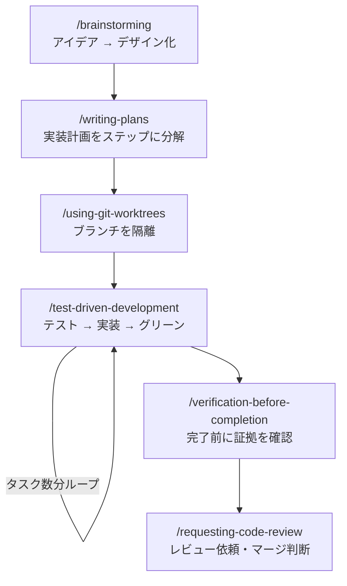
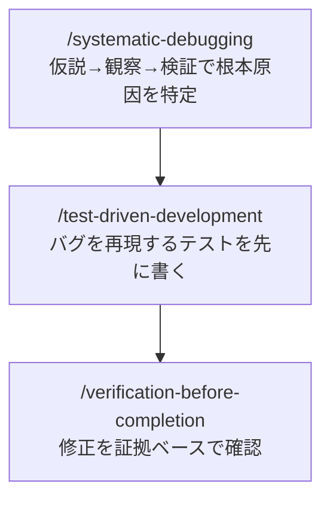

## はじめに

この記事は **Superpowersをすでにインストールしている方**向けのチートシートです。

「スキルがたくさんあるけど、結局いつ何を使えばいいの？」という疑問に答えます。よくある3つの作業シナリオ別にワークフローをまとめ、最後に全スキルの一覧表を付録として掲載しています。

## ワークフロー1: 新機能を実装するとき

### 各スキルの役割

<!-- markdownlint-disable MD013 -->
| スキル | コマンド | やること |
| -------- | ---------- | --------- |
| brainstorming | `/brainstorming` | 「何を作るか」を曖昧なまま実装しないための設計セッション |
| writing-plans | `/writing-plans` | 設計をステップ単位の実装計画に落とし込む |
| using-git-worktrees | `/using-git-worktrees` | 作業ブランチをmainから隔離する |
| test-driven-development | `/test-driven-development` | テストを先に書いてから実装する |
| verification-before-completion | `/verification-before-completion` | 「できた」と言う前にコマンド出力で確認する |
| requesting-code-review | `/requesting-code-review` | マージ前のセルフレビューとレビュー依頼 |
<!-- markdownlint-enable MD013 -->

## ワークフロー2: バグを修正するとき

### 各スキルの役割

<!-- markdownlint-disable MD013 -->
| スキル | コマンド | やること |
| ------ | -------- | ------- |
| systematic-debugging | `/systematic-debugging` | 思い込みで直す前に根本原因を特定するサイクルを強制する |
| test-driven-development | `/test-driven-development` | バグを再現するテストを先に書き、修正後にグリーンになることを確認 |
| verification-before-completion | `/verification-before-completion` | 「直った」と言う前に実際にコマンドで確認する |
<!-- markdownlint-enable MD013 -->
