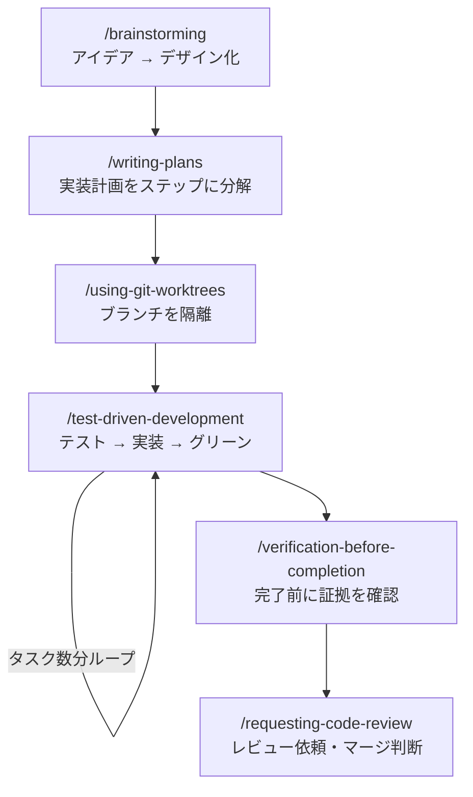
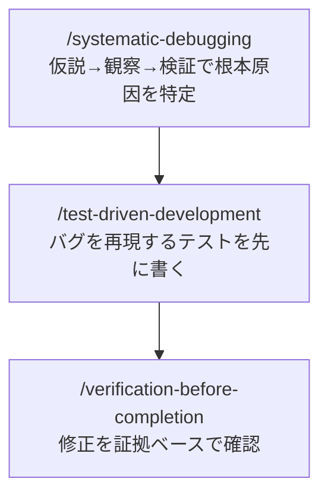
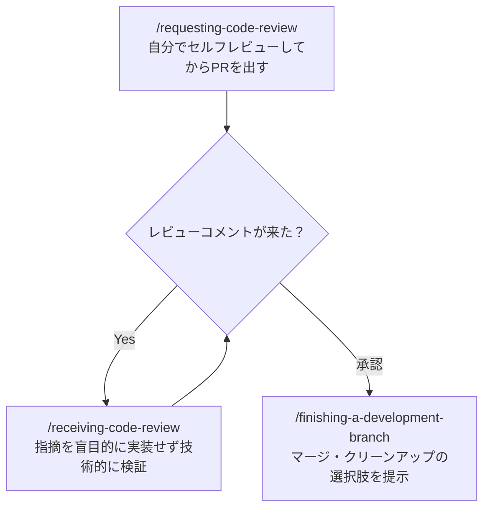

## はじめに

この記事は **Superpowersをすでにインストールしている方**向けのチートシートです。

「スキルがたくさんあるけど、結局いつ何を使えばいいの？」という疑問に答えます。よくある3つの作業シナリオ別にワークフローをまとめ、最後に全スキルの一覧表を付録として掲載しています。

## ワークフロー1: 新機能を実装するとき

### 各スキルの役割

<!-- markdownlint-disable MD013 -->
| スキル | コマンド | やること |
| -------- | ---------- | --------- |
| brainstorming | `/brainstorming` | 「何を作るか」を曖昧なまま実装しないための設計セッション |
| writing-plans | `/writing-plans` | 設計をステップ単位の実装計画に落とし込む |
| using-git-worktrees | `/using-git-worktrees` | 作業ブランチをmainから隔離する |
| test-driven-development | `/test-driven-development` | テストを先に書いてから実装する |
| verification-before-completion | `/verification-before-completion` | 「できた」と言う前にコマンド出力で確認する |
| requesting-code-review | `/requesting-code-review` | マージ前のセルフレビューとレビュー依頼 |
<!-- markdownlint-enable MD013 -->

## ワークフロー2: バグを修正するとき

### 各スキルの役割

<!-- markdownlint-disable MD013 -->
| スキル | コマンド | やること |
| ------ | -------- | ------- |
| systematic-debugging | `/systematic-debugging` | 思い込みで直す前に根本原因を特定するサイクルを強制する |
| test-driven-development | `/test-driven-development` | バグを再現するテストを先に書き、修正後にグリーンになることを確認 |
| verification-before-completion | `/verification-before-completion` | 「直った」と言う前に実際にコマンドで確認する |
<!-- markdownlint-enable MD013 -->

## ワークフロー3: PRを出してマージするとき

### 各スキルの役割

<!-- markdownlint-disable MD013 -->
| スキル | コマンド | やること |
| ------ | -------- | ------- |
| requesting-code-review | `/requesting-code-review` | PR作成前にセルフレビューのチェックリストを実行する |
| receiving-code-review | `/receiving-code-review` | レビュー指摘を盲目的に実装せず、技術的に検証してから対応する |
| finishing-a-development-branch | `/finishing-a-development-branch` | マージ・squash・削除などの選択肢を整理して完了させる |
<!-- markdownlint-enable MD013 -->

## 付録: 全スキル一覧

<!-- markdownlint-disable MD013 -->
| スキル名 | コマンド | 発動タイミング |
| -------- | -------- | -------------- |
| brainstorming | `/brainstorming` | 新機能・変更を作る前（必須） |
| writing-plans | `/writing-plans` | specが確定したら実装計画を作るとき |
| using-git-worktrees | `/using-git-worktrees` | 実装開始前・ブランチ隔離が必要なとき |
| test-driven-development | `/test-driven-development` | 実装コードを書く前（必須） |
| executing-plans | `/executing-plans` | 別セッションで計画を実行するとき |
| subagent-driven-development | `/subagent-driven-development` | 独立タスクを並列実行するとき |
| dispatching-parallel-agents | `/dispatching-parallel-agents` | 2つ以上の独立タスクがあるとき |
| systematic-debugging | `/systematic-debugging` | バグ・テスト失敗・予期しない挙動に直面したとき |
| verification-before-completion | `/verification-before-completion` | 「完了」「修正済み」と言う前（必須） |
| requesting-code-review | `/requesting-code-review` | 実装完了・マージ前のセルフレビュー |
| receiving-code-review | `/receiving-code-review` | レビューコメントを受け取ったとき |
| finishing-a-development-branch | `/finishing-a-development-branch` | 実装完了・マージ方法を決めるとき |
| writing-skills | `/writing-skills` | 新しいスキルを作成・編集するとき |
| using-superpowers | 自動（会話開始時） | セッション開始時に自動適用 |
<!-- markdownlint-enable MD013 -->
