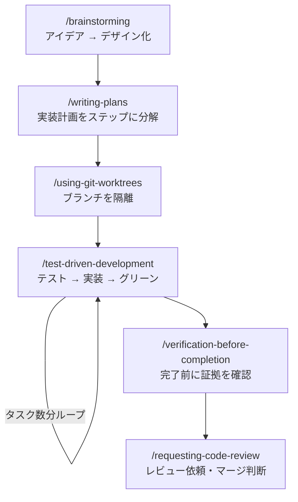
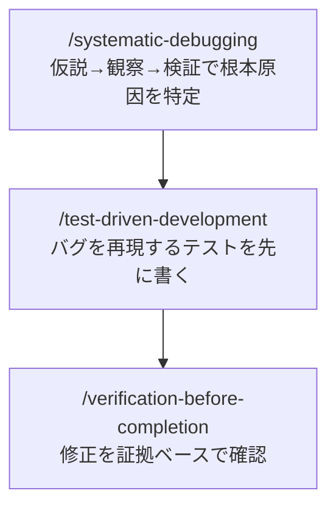
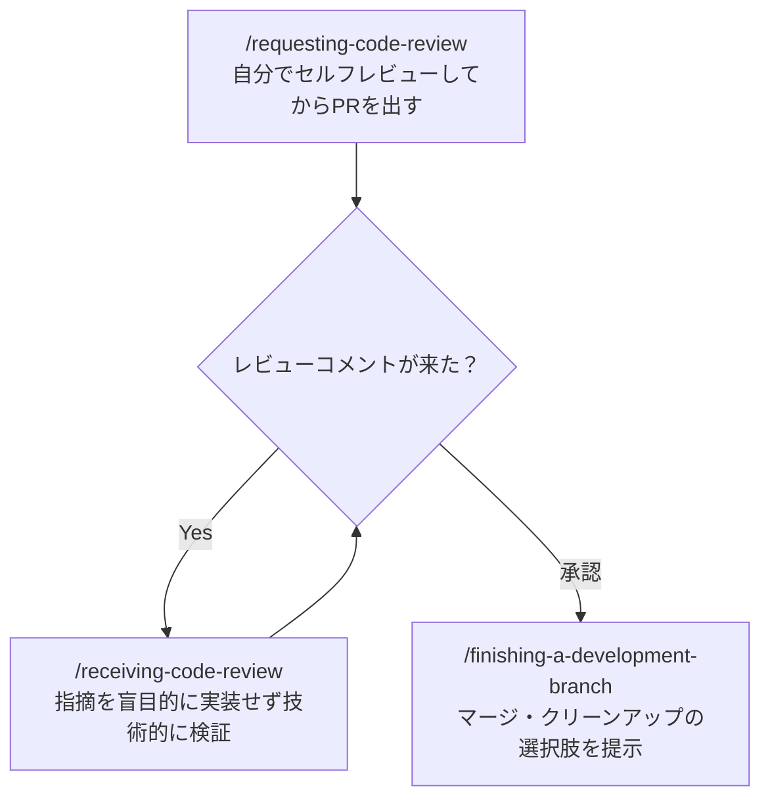

# Superpowers チートシート記事 Implementation Plan

> **For agentic workers:** REQUIRED SUB-SKILL: Use superpowers:subagent-driven-development (recommended) or superpowers:executing-plans to implement this plan task-by-task. Steps use checkbox (`- [ ]`) syntax for tracking.

**Goal:** Superpowers導入済みユーザー向けに「いつどのスキルを使うか」をワークフロー図＋一覧表で示すZenn記事を作成する。

**Architecture:** `articles/superpowers-cheatsheet.md` を新規作成し、3つのワークフローセクション（新機能・バグ修正・PR）とスキル一覧表（付録）で構成する。フロー図はMermaidを使用。画像なし。

**Tech Stack:** Zenn CLI (`npx zenn`), Markdownlint (`npm run lint:md`)

---

## File Structure

- Create: `articles/superpowers-cheatsheet.md`
- Create: `images/superpowers-cheatsheet/` （空ディレクトリ、`.keep`で管理）
- Branch: `article/superpowers-cheatsheet`

---

### Task 1: ブランチ作成・記事ファイルのセットアップ

**Files:**
- Create: `articles/superpowers-cheatsheet.md`
- Create: `images/superpowers-cheatsheet/.keep`

- [ ] **Step 1: ブランチを作成する**

```bash
git checkout -b article/superpowers-cheatsheet
```

Expected: `Switched to a new branch 'article/superpowers-cheatsheet'`

- [ ] **Step 2: 記事ファイルを生成する**

```bash
npx zenn new:article --slug superpowers-cheatsheet --title "Superpowers チートシート — どのスキルをいつ使うか完全ガイド" --type tech --emoji ⚡
```

Expected: `articles/superpowers-cheatsheet.md` が生成される

- [ ] **Step 3: 画像ディレクトリを作成する**

```bash
mkdir -p images/superpowers-cheatsheet && touch images/superpowers-cheatsheet/.keep
```

- [ ] **Step 4: frontmatterを更新する**

`articles/superpowers-cheatsheet.md` の frontmatter を以下に書き換える：

```yaml
---
title: "Superpowers チートシート — どのスキルをいつ使うか完全ガイド"
emoji: "⚡"
type: "tech"
topics: ["claudecode", "superpowers", "ai", "開発効率化"]
published: false
---
```

- [ ] **Step 5: lintチェックして問題がないことを確認する**

```bash
npm run lint:md
```

Expected: エラーなし

- [ ] **Step 6: コミットする**

```bash
git add articles/superpowers-cheatsheet.md images/superpowers-cheatsheet/.keep
git commit -m "feat: scaffold Superpowers cheatsheet article"
```

---

### Task 2: はじめにセクションを書く

**Files:**
- Modify: `articles/superpowers-cheatsheet.md`

- [ ] **Step 1: frontmatterの直後に「はじめに」を追記する**

frontmatterの `---` の直後から以下を追記する：

```markdown
## はじめに

この記事は **Superpowersをすでにインストールしている方**向けのチートシートです。

「スキルがたくさんあるけど、結局いつ何を使えばいいの？」という疑問に答えます。よくある3つの作業シナリオ別にワークフローをまとめ、最後に全スキルの一覧表を付録として掲載しています。
```

- [ ] **Step 2: lintチェックする**

```bash
npm run lint:md
```

Expected: エラーなし

- [ ] **Step 3: コミットする**

```bash
git add articles/superpowers-cheatsheet.md
git commit -m "docs: add intro section to Superpowers cheatsheet"
```

---

### Task 3: ワークフロー1「新機能を実装するとき」を書く

**Files:**
- Modify: `articles/superpowers-cheatsheet.md`

- [ ] **Step 1: ワークフロー1セクションを追記する**

「はじめに」セクションの後ろに以下を追記する：

```markdown
## ワークフロー1: 新機能を実装するとき



### 各スキルの役割

| スキル | コマンド | やること |
|--------|----------|---------|
| brainstorming | `/brainstorming` | 「何を作るか」を曖昧なまま実装しないための設計セッション |
| writing-plans | `/writing-plans` | 設計をステップ単位の実装計画に落とし込む |
| using-git-worktrees | `/using-git-worktrees` | 作業ブランチをmainから隔離する |
| test-driven-development | `/test-driven-development` | テストを先に書いてから実装する |
| verification-before-completion | `/verification-before-completion` | 「できた」と言う前にコマンド出力で確認する |
| requesting-code-review | `/requesting-code-review` | マージ前のセルフレビューとレビュー依頼 |
```

- [ ] **Step 2: lintチェックする**

```bash
npm run lint:md
```

Expected: エラーなし（長い行は `<!-- markdownlint-disable MD013 -->` で囲む）

- [ ] **Step 3: コミットする**

```bash
git add articles/superpowers-cheatsheet.md
git commit -m "docs: add workflow 1 (new feature) to cheatsheet"
```

---

### Task 4: ワークフロー2「バグを修正するとき」を書く

**Files:**
- Modify: `articles/superpowers-cheatsheet.md`

- [ ] **Step 1: ワークフロー2セクションを追記する**

ワークフロー1セクションの後ろに以下を追記する：

```markdown
## ワークフロー2: バグを修正するとき



### 各スキルの役割

| スキル | コマンド | やること |
|--------|----------|---------|
| systematic-debugging | `/systematic-debugging` | 思い込みで直す前に根本原因を特定するサイクルを強制する |
| test-driven-development | `/test-driven-development` | バグを再現するテストを先に書き、修正後にグリーンになることを確認 |
| verification-before-completion | `/verification-before-completion` | 「直った」と言う前に実際にコマンドで確認する |
```

- [ ] **Step 2: lintチェックする**

```bash
npm run lint:md
```

Expected: エラーなし

- [ ] **Step 3: コミットする**

```bash
git add articles/superpowers-cheatsheet.md
git commit -m "docs: add workflow 2 (bug fix) to cheatsheet"
```

---

### Task 5: ワークフロー3「PRを出してマージするとき」を書く

**Files:**
- Modify: `articles/superpowers-cheatsheet.md`

- [ ] **Step 1: ワークフロー3セクションを追記する**

ワークフロー2セクションの後ろに以下を追記する：

```markdown
## ワークフロー3: PRを出してマージするとき



### 各スキルの役割

| スキル | コマンド | やること |
|--------|----------|---------|
| requesting-code-review | `/requesting-code-review` | PR作成前にセルフレビューのチェックリストを実行する |
| receiving-code-review | `/receiving-code-review` | レビュー指摘を盲目的に実装せず、技術的に検証してから対応する |
| finishing-a-development-branch | `/finishing-a-development-branch` | マージ・squash・削除などの選択肢を整理して完了させる |
```

- [ ] **Step 2: lintチェックする**

```bash
npm run lint:md
```

Expected: エラーなし

- [ ] **Step 3: コミットする**

```bash
git add articles/superpowers-cheatsheet.md
git commit -m "docs: add workflow 3 (PR/merge) to cheatsheet"
```

---

### Task 6: スキル一覧表（付録）を書く

**Files:**
- Modify: `articles/superpowers-cheatsheet.md`

- [ ] **Step 1: 付録セクションを追記する**

ワークフロー3セクションの後ろに以下を追記する：

```markdown
## 付録: 全スキル一覧

<!-- markdownlint-disable MD013 -->
| スキル名 | コマンド | 発動タイミング |
|----------|----------|----------------|
| brainstorming | `/brainstorming` | 新機能・変更を作る前（必須） |
| writing-plans | `/writing-plans` | specが確定したら実装計画を作るとき |
| using-git-worktrees | `/using-git-worktrees` | 実装開始前・ブランチ隔離が必要なとき |
| test-driven-development | `/test-driven-development` | 実装コードを書く前（必須） |
| executing-plans | `/executing-plans` | 別セッションで計画を実行するとき |
| subagent-driven-development | `/subagent-driven-development` | 独立タスクを並列実行するとき |
| dispatching-parallel-agents | `/dispatching-parallel-agents` | 2つ以上の独立タスクがあるとき |
| systematic-debugging | `/systematic-debugging` | バグ・テスト失敗・予期しない挙動に直面したとき |
| verification-before-completion | `/verification-before-completion` | 「完了」「修正済み」と言う前（必須） |
| requesting-code-review | `/requesting-code-review` | 実装完了・マージ前のセルフレビュー |
| receiving-code-review | `/receiving-code-review` | レビューコメントを受け取ったとき |
| finishing-a-development-branch | `/finishing-a-development-branch` | 実装完了・マージ方法を決めるとき |
| writing-skills | `/writing-skills` | 新しいスキルを作成・編集するとき |
| using-superpowers | 自動（会話開始時） | セッション開始時に自動適用 |
<!-- markdownlint-enable MD013 -->
```

- [ ] **Step 2: lintチェックする**

```bash
npm run lint:md
```

Expected: エラーなし

- [ ] **Step 3: コミットする**

```bash
git add articles/superpowers-cheatsheet.md
git commit -m "docs: add skill reference table to cheatsheet"
```

---

### Task 7: 最終lint確認・記事完成

**Files:**
- Modify: `articles/superpowers-cheatsheet.md`（必要に応じて修正）

- [ ] **Step 1: 全体lintを実行する**

```bash
npm run lint:md
```

Expected: エラーなし。エラーがあれば `npm run lint:md:fix` で自動修正してから差分を確認する。

- [ ] **Step 2: 記事全体を通読して構成を確認する**

- 「はじめに」→ ワークフロー1→2→3 → 付録の順になっているか
- 各ワークフローのMermaid図とその下の表が対応しているか
- 付録の表にすべて14スキルが揃っているか

- [ ] **Step 3: 問題があれば修正してコミットする**

```bash
git add articles/superpowers-cheatsheet.md
git commit -m "fix: final lint and review fixes for cheatsheet"
```

- [ ] **Step 4: プレビューで確認する（任意）**

```bash
npm run preview
```

ブラウザで `http://localhost:8000` を開き、Mermaidが正しく描画されているか確認する。
